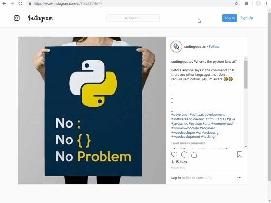

# IG+VSCO fullsize

Click extension icon to open current Instagram or VSCO image in the highest resolution possible.

Released on [Chrome Web Store](https://chrome.google.com/webstore/detail/ig+vsco-fullsize/ngdfnokoifnihnknoibnbhfhnkmlfocb) and [Firefox Add-ons](https://addons.mozilla.org/en-US/firefox/addon/ig-vsco-fullsize/). See example below:

Functionality tested on 2019-11-26.

## Changelog

### 1.2.5

Removed blocking Instagram login dialog.

### 1.2.4

Added Instagram HD profile picture support. This requires being logged in, but falls back to default profile picture.

### 1.2.3

- Fixed broken VSCO profile picture support

### 1.2.2

- Added VSCO and Instagram profile picture support
- Improved tab placement/inheritance

### 1.2.1

Added VSCO video support.

### 1.2

Added wider range of supported formats for Instagram:

- Supports single and multiple images
- Supports single and multiple videos

Added functionality to open VSCO images inn the highest resolution possible.

### 1.0

Initial store release. Basic Instagram functionality.

## License

The software in this repo is released under [CC-BY-SA 4.0](https://creativecommons.org/licenses/by-sa/4.0/), also found in the `LICENSE` file.

## Credits

The Instagram approach used is derived from [this StackOverflow answer](https://stackoverflow.com/a/48296606/2732991).

The logo icon is the "camera" icon from [Material Design Icons](https://materialdesignicons.com/).
